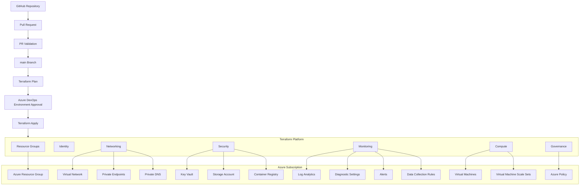

# Architecture

## Overview

The Enterprise Azure Landing Zone Platform is implemented using Terraform with reusable modules and environment-specific Terraform roots.

The infrastructure is divided into seven independent domains:

1. Resource Groups
2. Identity
3. Networking
4. Security
5. Monitoring
6. Compute
7. Governance

Each domain has its own Terraform root and independent Terraform state.

The platform supports multiple environments:

- Development
- Test
- Production

Each environment follows the same seven-domain structure.

---

## Repository Structure

```text
enterprise-azure-landing-zone-platform/

├── bootstrap/
│
├── docs/
│   ├── architecture/
│   │   └── README.md
│   ├── deployment/
│   │   └── README.md
│   └── operations/
│       └── README.md
│
├── environments/
│   │
│   ├── dev/
│   │   ├── resource-groups/
│   │   ├── identity/
│   │   ├── networking/
│   │   ├── security/
│   │   ├── monitoring/
│   │   ├── compute/
│   │   └── governance/
│   │
│   ├── test/
│   │   ├── resource-groups/
│   │   ├── identity/
│   │   ├── networking/
│   │   ├── security/
│   │   ├── monitoring/
│   │   ├── compute/
│   │   └── governance/
│   │
│   └── prod/
│       ├── resource-groups/
│       ├── identity/
│       ├── networking/
│       ├── security/
│       ├── monitoring/
│       ├── compute/
│       └── governance/
│
├── modules/
│   ├── compute/
│   ├── governance/
│   ├── identity/
│   ├── monitoring/
│   ├── networking/
│   ├── resource-group/
│   └── security/
│
├── pipelines/
│   ├── templates/
│   │   └── terraform-domain.yml
│   │
│   ├── dev/
│   │   ├── terraform-dev-resource-groups.yml
│   │   ├── terraform-dev-identity.yml
│   │   ├── terraform-dev-networking.yml
│   │   ├── terraform-dev-security.yml
│   │   ├── terraform-dev-monitoring.yml
│   │   ├── terraform-dev-compute.yml
│   │   └── terraform-dev-governance.yml
│   │
│   ├── test/
│   │   ├── terraform-test-resource-groups.yml
│   │   ├── terraform-test-identity.yml
│   │   ├── terraform-test-networking.yml
│   │   ├── terraform-test-security.yml
│   │   ├── terraform-test-monitoring.yml
│   │   ├── terraform-test-compute.yml
│   │   └── terraform-test-governance.yml
│   │
│   ├── prod/
│   │   ├── terraform-prod-resource-groups.yml
│   │   ├── terraform-prod-identity.yml
│   │   ├── terraform-prod-networking.yml
│   │   ├── terraform-prod-security.yml
│   │   ├── terraform-prod-monitoring.yml
│   │   ├── terraform-prod-compute.yml
│   │   └── terraform-prod-governance.yml
│   │
│   └── terraform-bootstrap.yml
│
└── scripts/
```

---

## Environment Architecture

Each environment follows the same seven-domain structure.

The domains are independent Terraform roots:

```text
Environment
    |
    +-- Resource Groups
    |
    +-- Identity
    |
    +-- Networking
    |
    +-- Security
    |
    +-- Monitoring
    |
    +-- Compute
    |
    +-- Governance
```

Each domain has its own Terraform configuration and state file.

Changes to one domain should not directly modify the Terraform state of another domain.

---

## End-to-End Architecture

The platform uses GitHub for source control and Azure DevOps for Terraform validation and deployment.



The diagram represents Terraform domain ownership.

Compute owns the Virtual Machines and Virtual Machine Scale Sets.

Monitoring owns monitoring resources such as Diagnostic Settings, Alerts and Data Collection Rules.

Networking owns networking resources such as Virtual Networks, Private Endpoints and Private DNS.

---

## Terraform State Architecture

Terraform state is stored remotely in Azure Storage.

```text
Resource Group:
rg-ealz-tfstate-eus2-001

Storage Account:
stealztfstate001

Container:
tfstate
```

Each environment and domain uses an independent state file.

### Development

```text
dev-resource-groups.tfstate
dev-identity.tfstate
dev-networking.tfstate
dev-security.tfstate
dev-monitoring.tfstate
dev-compute.tfstate
dev-governance.tfstate
```

### Test

```text
test-resource-groups.tfstate
test-identity.tfstate
test-networking.tfstate
test-security.tfstate
test-monitoring.tfstate
test-compute.tfstate
test-governance.tfstate
```

### Production

```text
prod-resource-groups.tfstate
prod-identity.tfstate
prod-networking.tfstate
prod-security.tfstate
prod-monitoring.tfstate
prod-compute.tfstate
prod-governance.tfstate
```

---

## Cross-Domain Resource Ownership

Each Azure resource is managed by only one Terraform domain.

```text
Resource Group
    └── Resource Groups

Managed Identity
    └── Identity

Private Endpoint
    └── Networking

Private DNS Zone
    └── Networking

Key Vault
    └── Security

Storage Account
    └── Security

Azure Container Registry
    └── Security

Diagnostic Settings
    └── Monitoring

Data Collection Rules
    └── Monitoring

Virtual Machine
    └── Compute

Virtual Machine Scale Set
    └── Compute

Azure Policy Assignment
    └── Governance
```

This prevents multiple Terraform states from attempting to manage the same Azure resource.

---

## Domain Ownership

### Resource Groups

Responsible for:

- Azure Resource Groups

The Resource Groups Terraform root manages the resource groups required by the environment.

### Identity

Responsible for:

- User-assigned Managed Identity
- Managed Identity RBAC assignments
- Key Vault access for the Managed Identity
- Storage Account access for the Managed Identity
- Azure Container Registry access for the Managed Identity

Managed Identity and its role assignments are owned only by Identity.

### Networking

Responsible for:

- Virtual Network
- Workload Subnet
- Bastion Subnet
- Network Security Group
- NSG Rules
- Route Table
- NAT Gateway
- NAT Public IP
- Bastion
- Bastion Public IP
- Private Endpoints
- Private DNS Zones
- Private DNS Zone Virtual Network Links
- Private Endpoint DNS Zone Groups

Networking owns Private Endpoints and Private DNS resources.

### Security

Responsible for:

- Azure Key Vault
- Azure Storage Account
- Azure Container Registry
- Security-related RBAC assignments

Private Endpoints and Private DNS are not managed by Security.

They are owned by Networking.

Managed Identity and its RBAC assignments are not managed by Security.

They are owned by Identity.

### Monitoring

Responsible for:

- Log Analytics Workspace
- Diagnostic Settings
- Diagnostic Policy Assignments
- Monitoring RBAC
- Action Groups
- Activity Log Alerts
- Metric Alerts
- Scheduled Query Alerts
- Data Collection Rules
- Data Collection Rule Associations

Diagnostic policy assignments and their required monitoring RBAC remain owned by Monitoring.

Monitoring provides monitoring and telemetry configuration for resources owned by other domains, but it does not take ownership of those resources.

### Compute

Responsible for:

- Availability Set
- Linux Virtual Machine
- Windows Virtual Machine
- Linux Virtual Machine Scale Set
- Network Interfaces
- Managed Disk
- VM Data Disk Attachment
- VM Extensions
- VMSS Extensions

Networking resources such as VNets, subnets and NSGs remain owned by Networking.

Monitoring resources such as Data Collection Rules, associations and alerts remain owned by Monitoring.

### Governance

Responsible for:

- Custom Azure Policy Definitions
- Azure Policy Assignments

Monitoring diagnostic policy assignments remain under Monitoring ownership.

---

## Pipeline Organization

```text
pipelines/

├── templates/
│   └── terraform-domain.yml

├── dev/
│   └── 7 domain pipelines

├── test/
│   └── 7 domain pipelines

├── prod/
│   └── 7 domain pipelines

└── terraform-bootstrap.yml
```

The shared template contains the common Terraform workflow.

The environment-specific pipeline files provide the values that differ between environments and domains.

---

## Environment Pipeline Model

Each environment contains seven domain pipelines.

### Development

```text
terraform-dev-resource-groups.yml
terraform-dev-identity.yml
terraform-dev-networking.yml
terraform-dev-security.yml
terraform-dev-monitoring.yml
terraform-dev-compute.yml
terraform-dev-governance.yml
```

### Test

```text
terraform-test-resource-groups.yml
terraform-test-identity.yml
terraform-test-networking.yml
terraform-test-security.yml
terraform-test-monitoring.yml
terraform-test-compute.yml
terraform-test-governance.yml
```

### Production

```text
terraform-prod-resource-groups.yml
terraform-prod-identity.yml
terraform-prod-networking.yml
terraform-prod-security.yml
terraform-prod-monitoring.yml
terraform-prod-compute.yml
terraform-prod-governance.yml
```

---

## Pipeline Flow

### Pull Request

```text
Pull Request
     |
     v
Terraform Format Check
     |
     v
Terraform Init
     |
     v
Terraform Validate
     |
     v
Terraform Security Scan
     |
     v
Terraform Plan
     |
     v
Publish Plan
```

No Terraform Apply is performed during Pull Request validation.

### Main Branch

```text
Merge to main
     |
     v
Terraform Plan
     |
     v
Publish Plan
     |
     v
Environment Approval
     |
     v
Terraform Apply
```

---

## Pipeline Isolation

Each environment/domain pipeline operates against its corresponding Terraform root and state.

### Development

```text
terraform-dev-compute.yml
        |
        v
environments/dev/compute/
        |
        v
dev-compute.tfstate
```

### Test

```text
terraform-test-compute.yml
        |
        v
environments/test/compute/
        |
        v
test-compute.tfstate
```

### Production

```text
terraform-prod-compute.yml
        |
        v
environments/prod/compute/
        |
        v
prod-compute.tfstate
```

This keeps environment and domain deployments isolated.

---

## Pipeline Count

The platform contains:

```text
3 environments
×
7 domains
=
21 domain pipelines
```

All 21 domain pipelines use the shared Terraform pipeline template.

The Terraform bootstrap pipeline is separate from the 21 environment/domain pipelines.

---

## Infrastructure Separation

The platform separates infrastructure responsibilities into distinct Terraform domains.

```text
Resource Groups
        |
        +-- Resource Group resources

Identity
        |
        +-- Managed Identity
        +-- Identity RBAC

Networking
        |
        +-- VNet
        +-- Subnets
        +-- NSGs
        +-- Routes
        +-- NAT
        +-- Bastion
        +-- Private Endpoints
        +-- Private DNS

Security
        |
        +-- Key Vault
        +-- Storage Account
        +-- Container Registry
        +-- Security RBAC

Monitoring
        |
        +-- Log Analytics
        +-- Diagnostics
        +-- Alerts
        +-- Data Collection Rules
        +-- Monitoring RBAC

Compute
        |
        +-- Virtual Machines
        +-- VMSS
        +-- Disks
        +-- Extensions

Governance
        |
        +-- Policy Definitions
        +-- Policy Assignments
```

---

## Design Principles

### Independent State

Each environment and domain has its own Terraform state.

### Single Resource Ownership

A resource is managed by only one Terraform root.

### Reusable Modules

Common infrastructure logic is implemented through reusable Terraform modules.

### Environment Separation

Development, Test and Production have separate Terraform roots, state files and deployment pipelines.

### Controlled Deployment

Pull Requests perform validation and planning.

Changes merged into `main` proceed through Plan, approval and Apply.

### Pipeline Reuse

Common pipeline logic is maintained in the shared Terraform domain template.

### Infrastructure Safety

Existing Azure resources should not be recreated when transferring Terraform ownership or restructuring Terraform state.

### Governance

Azure Policy is managed through the Governance Terraform domain.

### Monitoring

Monitoring configuration is managed centrally through the Monitoring Terraform domain without taking ownership of resources belonging to other domains.

---

## Final Architecture Model

The platform follows this model:

```text
                         GitHub
                            |
                            v
                     Pull Request
                            |
                            v
                   Azure DevOps
                            |
                 ---------------------
                 |                   |
          PR Validation          main Branch
                 |                   |
                 |                   v
                 |             Terraform Plan
                 |                   |
                 |                   v
                 |             Environment
                 |              Approval
                 |                   |
                 |                   v
                 |             Terraform Apply
                 |                   |
                 ---------------------
                            |
                            v
                   Terraform Platform
                            |
        ------------------------------------------------
        |          |          |          |       |     |
 Resource    Identity   Networking   Security Monitoring
  Groups
        |
        +-----------------------------------------------
        |                       |                       |
     Compute                Governance             Azure
```

The seven Terraform domains are independent ownership boundaries:

```text
Terraform Platform
      |
      +-- Resource Groups
      |
      +-- Identity
      |
      +-- Networking
      |
      +-- Security
      |
      +-- Monitoring
      |
      +-- Compute
      |
      +-- Governance
```

The platform is designed around:

```text
One Environment
      |
      +-- Seven Terraform Domains
      |
      +-- Seven Independent State Files
      |
      +-- Seven Domain Pipelines
      |
      +-- Shared Pipeline Template
```

This architecture provides separation of ownership, isolated Terraform state, reusable infrastructure modules, environment separation, governance, monitoring, and controlled Azure deployments.